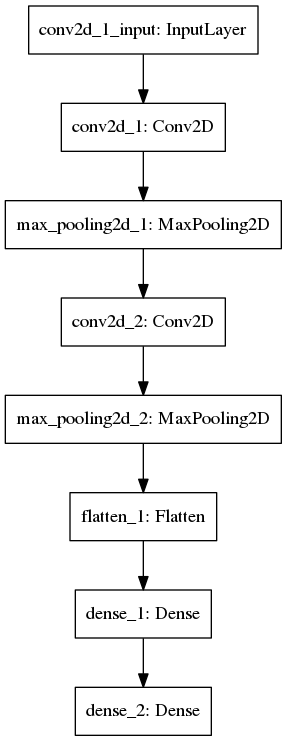

# Hacking CAPTCHA
Fun project hacking [Really Simple CAPTCHA](https://wordpress.org/plugins/really-simple-captcha/#description)

Initial idea and training sets: [reference_0](http://python.jobbole.com/89004/)
[reference_1](https://www.pyimagesearch.com/2017/12/11/image-classification-with-keras-and-deep-learning/)

## Data set

Data set is in s3: (s3://captcha-training-img/wordpress.zip)

## Methodology

### Extracting single character from given CAPTCHA

Given CAPTCHA, use openCV to find contour of each charachter, and save them into training dir. [Detail](/src/extract_character.ipynb)

### Train the neural network for single character

 

### Use the model to predict CAPTCHA

[Detail](/src/solve_captcha.ipynb)